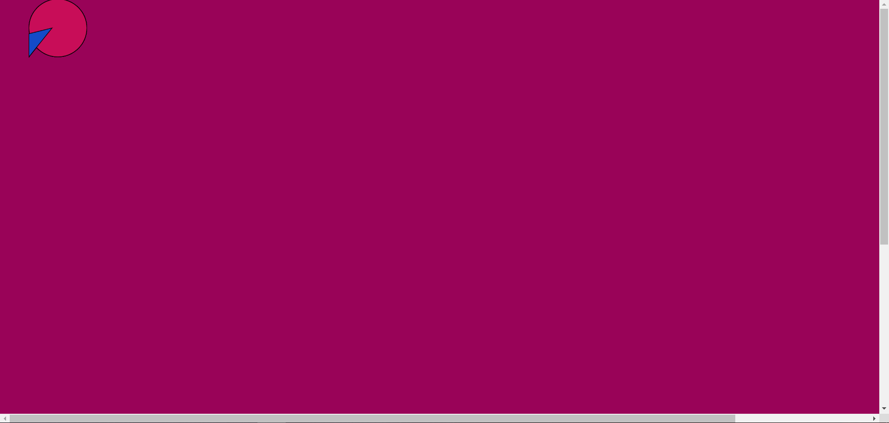

•	Describe your first independent coding process (in relation to thinking, reading, copying, modifying, writing, uploading, sharing, commenting code)

My first coding process evolved around a lot of experimenting with Atom and selecting certain syntaxes from p5.js. Since I don’t have much experience with coding in Javascript, I didn’t know was the outcome was going to look like, so therefore I just tried with different numbers, that differed a small bit from the original numbers from the syntax in p5.js. The actual writing of the code was a lot different from the usual experience I have with writing. The writing seems slow and every detail seems important to get certain result. Usually if you make a spelling error or two in an essay, the overall meaning or message can easily be found anyways. Whereas, in coding it just doesn’t work if you make a mistake in the Atom program. The reading also seems difficult for me, since I can’t spot the mistakes right away, so I often had to delete the whole sentence and start over with a certain syntax and fail again until I saw what was missing. On the other hand, I wasn’t sure exactly why it worked, when I did it right and that also seems frustrating, because I didn’t have a proper argument for my experiment. 

•	How your coding process is differ or similar to reading and writing text? (You may also reflect upon Annette Vee's text on coding literacy)

Reading and writing seems very natural to me and happens very quickly in a lot of aspects of my everyday life. Coding is not only like a new language, but also new way of thinking for me, because it demands a great deal of experimenting with no sort of gut-feeling and I think that’s the part that is most frustrating part about coding. Since it’s never been expected of me to code to “do good”, it seems like a new kind of literacy that’s emerging and still feels like a very technical area of practice even though Richard W. Hamming argued that coding should be a course taught to all liberal arts students, it still feels very limited what I can create through code, and I couldn’t describe in detail what steps I took get the result I got. 

•	What might be the potential and possibility of coding practice?

Coding practice is new way of thinking and express yourself creatively and is not just seen a mathematical form. Technology in general is fast evolving and the endless ways of working with programming creates new possibilities for communicating. 

